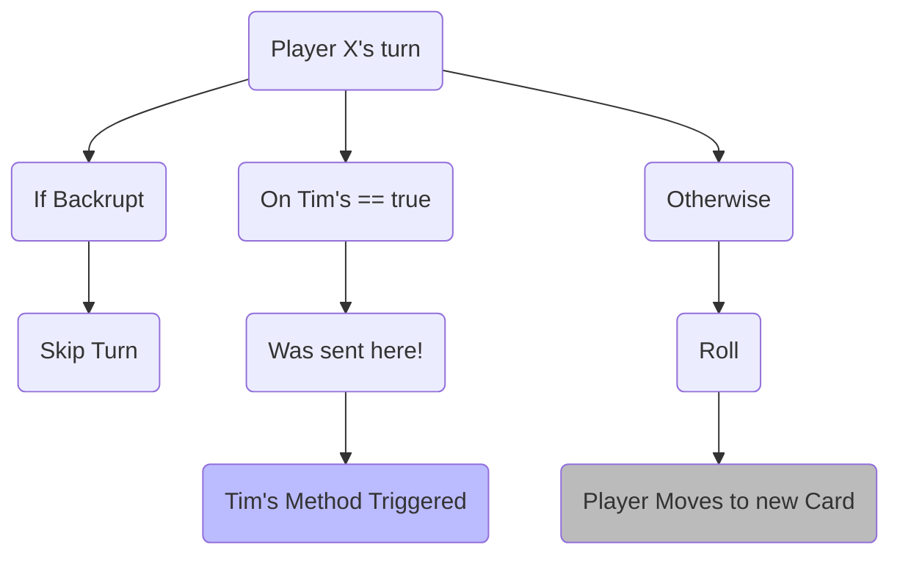
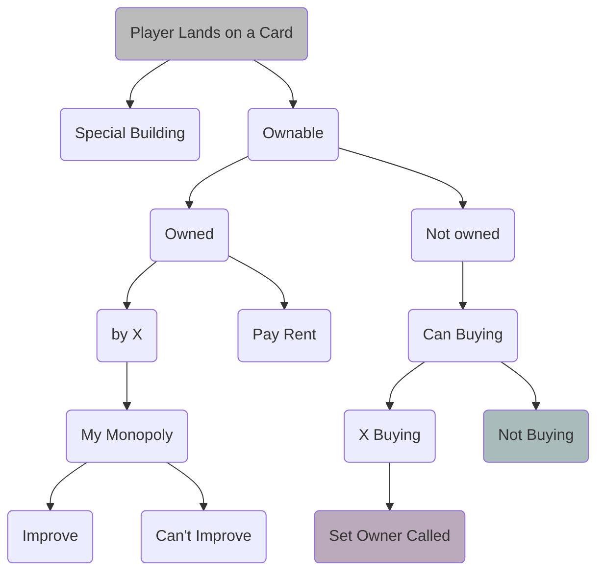
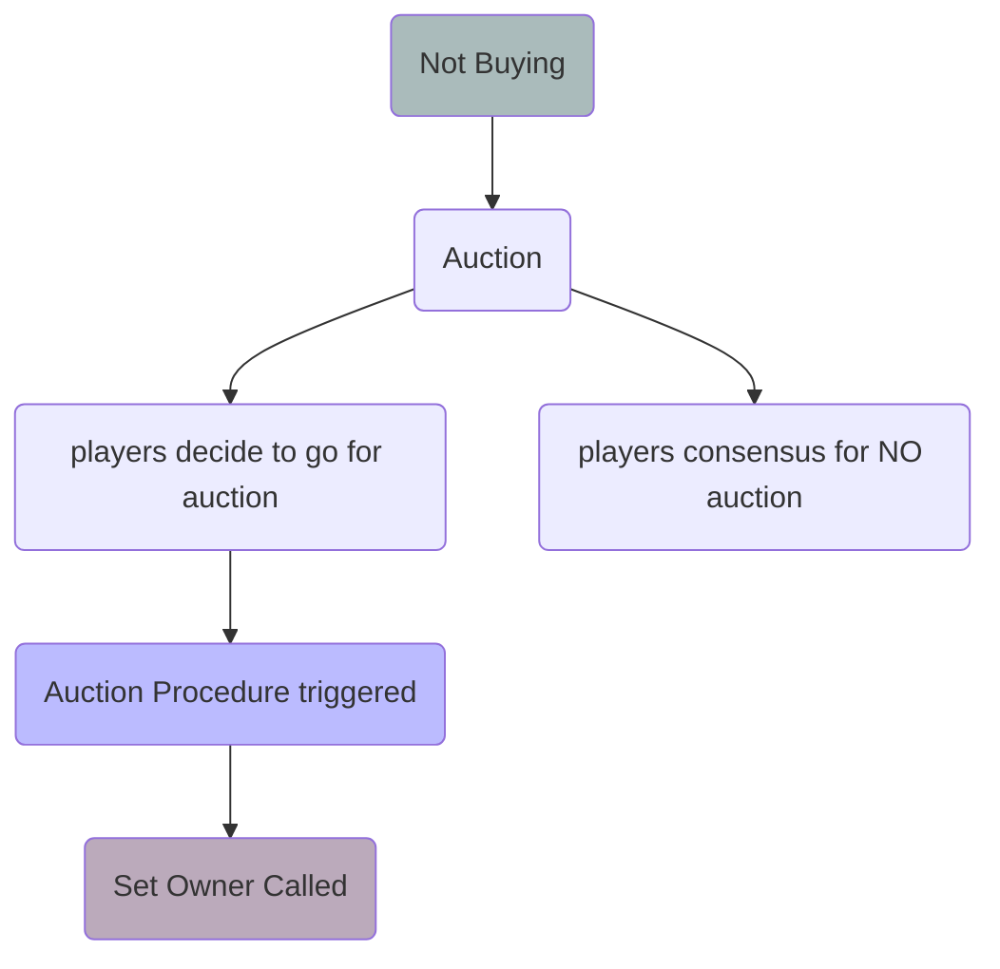
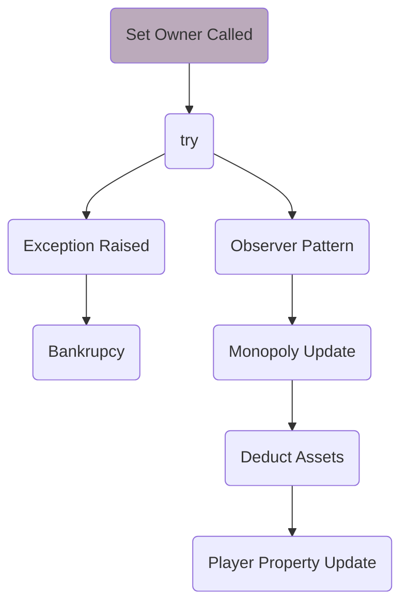
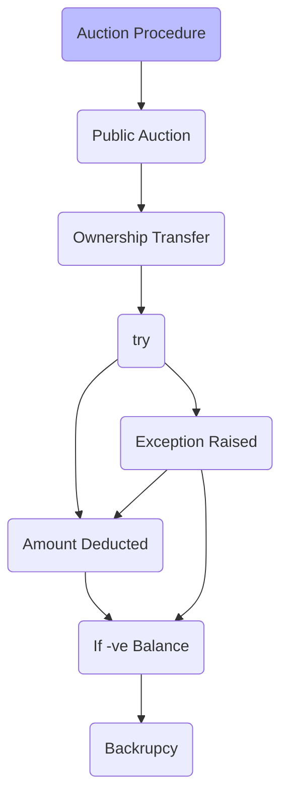

# Wotopoly - The UWaterloo Monopoly
---
Task List
- [x] player.h (Bector, (mod. Priyanshu) )
- [x] player.cc (BoilerPlate Ready + mod. Priyanshu)
- [x] grid.h
- [ ] grid.cc (BoilerPlate Ready)
- [x] roll2die.h
- [x] roll2die.cc
- [x] state.h (Bector (mod. Priyanshu))
- [x] property.h (Priyanshu+Bector)
- [x] property.cc (Bector (mod. Priyanshu))
- [x] Subject.h (Priyanshu)
- [x] observer.h (Priyanshu)
- [x] info.h (Priyanshu)
- [] rez.h (taken by:- Priyanshu)
- [x] academicInfo
- [ ] Improvements
- [ ] SNH All work (Building --> Bector)

---
## Plan Of Attack
Made By:
Medhansh Hinduja (mhinduja)
Priyanshu Sharma (p245shar)
Vinayak Bector (vbector)

### Introduction 
Monopoly is argubly the most favourite childhood game. As you may know, it revolves around Economics - buying, selling, renting and trading. It also involves a "luck" factor as one needs to roll two dice to move around the board. The position of a player determines subsequent actions that may happen. In this version of the game, our primary objective is to NOT get backrupt.

### Basic Implementation
As per the documentation provided, we should have atleast implemented the following functions

#### Loading in Saved Game and Starting a new Game
For saving and loading the files our main idea was to use  `std::ifstream`  to read from a file
Whereas 
#### Saving Games
`std::ofstream`  to write a file, it has a similar code structure to `std::ifstream`
Basic Code Structure
```C++
int main(){
	ifstream file{"InputWonopoly.txt"};
    ofstream file1("newfile.txt");
	// declaring and initializing an ifstream to open file 
	string s;
	while (file >> s){
		// Initalize the grid and State of players 
		// For the sake of the example code just cout
		file1 << s << endl;
	}
    // Closing the file
    file1.close();
}
// as soon as any fstream variable goes out of scope the file is closed
```

#### Rolling die & Subsequent Events
For rolling the die, generating a random number between 1 and 6, we are provided with a `shuffle.cc` 
Basic Code Structure
```C++
void print2die( std::vector<int> const & v) {
	for ( int i = 0; i < 2; i++ ){
		std::cout << v[i] << ' ';
	}
	std::cout << std::endl;
}

int main() {
	// vector of int, representing faces of die
	std::vector<int> v = { 1, 2, 3, 4, 5, 6 };
	// Generating a seed for Random No gen	
	unsigned seed = std::chrono::system_clock::now().time_since_epoch().count();
	// Using Random Engine
	std::default_random_engine rng{seed};
	// Shuffling our vector of pointers
	std::shuffle( v.begin(), v.end(), rng );
	// Printing the first two values in vector
	print2die(v);
	return 0;
}
```

#### Some Other Actions 
In this subsection we will be dealing with 
		-> Buying -- Trading -- Selling
		-> Declaring Backruptcy 
		-> Working with SLC and Needle Cards
The flow Chart depicting our line of thought while implementing the code

**Assume that there's a Player X**
On his turn flow of program would be as follows


**If he successfully rolls and lands on a new card**


**Steps When Player doesn't want to buy**


**Set Owner Procedure**


**Auction Procedure**

## Design Patterns 
We owe a big thank you to all the professors and support staff for making such a wonderful assignment on design patterns (and of course for multiple extensions for the assignment XDXD). Because it really helped us get an intuitive understanding of the Decorator Pattern and Observer Design Pattern. 
### Observer Pattern
As per our understanding in the Obsever Design Pattern
- Change in one object (let's say A), triggers updates in dependencies (a.k.a objects observing A).
- This means that we will need to have a list of all the observers to a given system stored, so that we can push notification as a stimuli
- In a4 we had cells which were observing themselves and toggling their color as per the requirement 
- For our Wotopoly, we have decided to opt for a similar route - cards are observing other cards in their faculty (for potential monopoly | when an established monopoly is broken | improvemnts to a building is made therefore restrictions)

As soon as the owner of a card (say a card belonging to Mathematics Faculty) is changed, the card 'asks' the player about the number of cards that the player owns of that faculty (in this example Maths) except for the current card. In case the reply is `1-x`, where x stands for the total number of card in that faculty (Maths), we can be certain that we are now in a Monopoly and the card will __notify observers__ with the StateType `EstMono`. Similarly, when moving out of Monopoly `DisMono` will be used to convey the message. On the other hand, when in a monopoly and improvement is made, `Block` will be called to activate all the restrictions (as per the rules of the game). The `Direction` will be very useful, in case we need to modify our code to accomodate faculy building which may not be adjecent to each other.


```C++
#ifndef STATE_H
#define STATE_H

/* State types are:
    EstMono -- The card has established that they are a monopoly, and request 
            all it's partners to toggle accordingly. This would be done using 
            an algorithm which would be discussed below. 
    DisMono -- The card has established that they are NO longer a monopoly,
            and therefore request all it's partners to toggle accordingly.
    Reply -- I have toggled as per the requirement.
    Block -- This state will be called when we are in a monopoly
            and we have now made an improvement. "Block" implies that 
            since we made an improvement in one of our buildings in 
            our monopoly, we have now some restrictions to deal with
*/
enum class StateType { EstMono, DisMono, Reply, Block };
enum class Direction { Right, Left };

struct State {
  StateType type;  // For Monopoly
  Direction direction;  // Relative Position of the piece
  Card * owner;
};

#endif
```


### Basic Timeline 
We wanted to finish a mojarity amount of work over the first weekend, just to have some some breathing space in the end. So, we are planning to finish __all the proprties__ during the first weekend, then parallely work on the textdisplay and grid. Finishing with the player, and hopefully the bonus component as well.
| Date | Tasks |
| ------- | ------- |
| 16July(Saturday) and 17July(Sunday) | All the Properties (including the SLC, Needles halls, Gym and the Residences)|
| 18July(Monday) | **Buffer** |
| 19July(Tuesday) | Working on player grid and textdisplay (If possible one person each) |
| 20July(Wednesday) | **Buffer** |
| 21July(Thursday) | Debugging (Making sure that the code complies :P) |
| 22July(Friday) | **Buffer** (Since, we are well aware that debugging might take a substantial amount of time - especially considering the number of files )|
| 23July(Saturday) | Extensively Testing our code (Functional and Performance) and making improvements (Efficiency and readability). We are also planning to work on the graphics display|
| 24July(Saturday) | Trying to implement the Bonus components  |
| 25July(Sunday) | **Buffer** |


