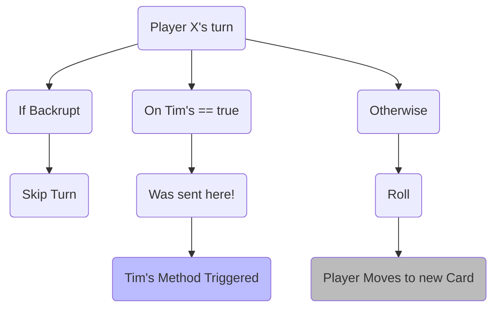
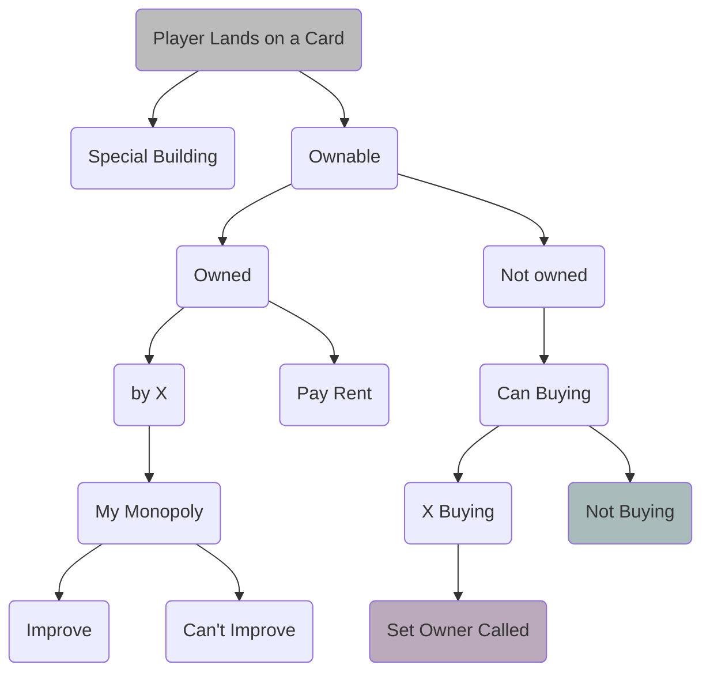
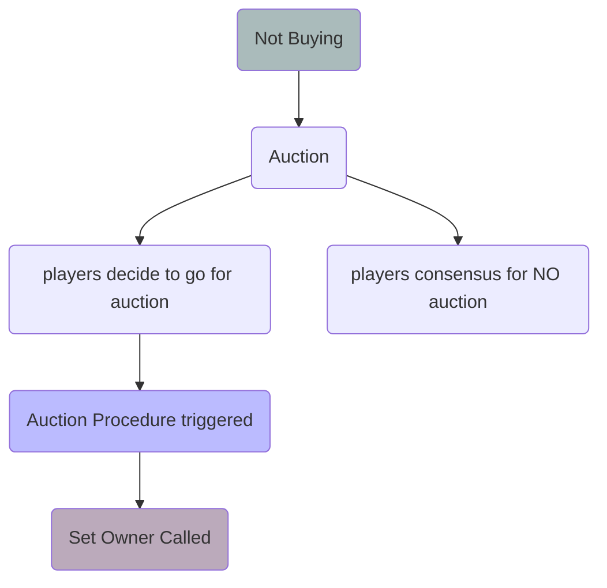
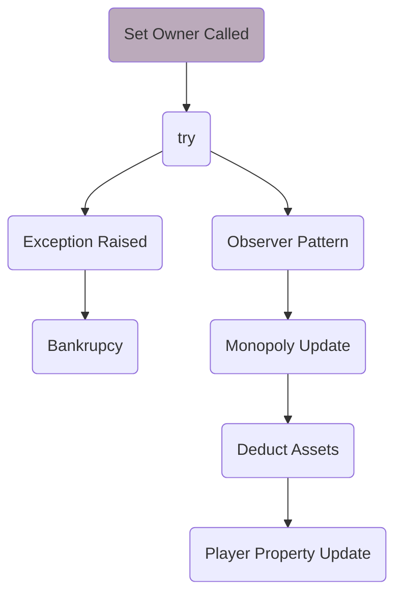
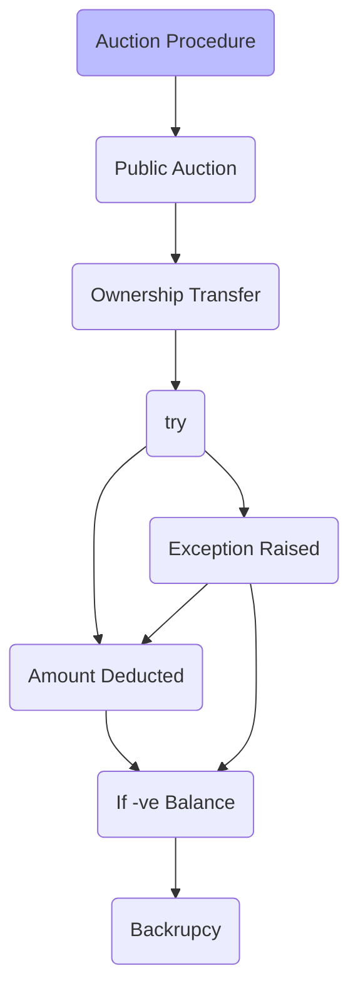

# Wotopoly - The UWaterloo Monopoly
---
Task List
GET COST NEEDS TO BE MADE
- [x] player.h (Bector, (mod. Priyanshu) )
- [x] player.cc (BoilerPlate Ready + mod. Priyanshu)
- [x] grid.h
- [ ] grid.cc (BoilerPlate Ready)
- [x] roll2die.h
- [x] roll2die.cc
- [x] state.h (Bector (mod. Priyanshu))
- [x] property.h (Priyanshu+Bector)
- [x] property.cc (Bector (mod. Priyanshu))
- [x] Subject.h (Priyanshu)
- [x] observer.h (Priyanshu)
- [x] info.h (Priyanshu)
- [ ] rez.h (taken by:- Priyanshu)
- [x] academicInfo
- [ ] Improvements
- [ ] SNH All work (Building --> Bector)
- [x] Makefile
- [ ] 4Special Cards
- [ ] Ctor and Dtors --> A
- [ ] Attach Obr
- [ ] Add Owner
- [ ] Tuition 
- [ ] CoOp Fee
---
## Plan Of Attack
Made By:
Medhansh Hinduja (mhinduja)
Priyanshu Sharma (p245shar)
Vinayak Bector (vbector)

### Introduction 
Monopoly is argubly the most favourite childhood game. As you may know, it revolves around Economics - buying, selling, renting and trading. It also involves a "luck" factor as one needs to roll two dice to move around the board. The position of a player determines subsequent actions that may happen. In this version of the game, our primary objective is to NOT get backrupt.

### Basic Implementation
As per the documentation provided, we should have atleast implemented the following functions

#### Loading in Saved Game and Starting a new Game
For saving and loading the files our main idea was to use  `std::ifstream`  to read from a file
Whereas 
#### Saving Games
`std::ofstream`  to write a file, it has a similar code structure to `std::ifstream`
Basic Code Structure
```C++
int main(){
	ifstream file{"InputWonopoly.txt"};
    ofstream file1("newfile.txt");
	// declaring and initializing an ifstream to open file 
	string s;
	while (file >> s){
		// Initalize the grid and State of players 
		// For the sake of the example code just cout
		file1 << s << endl;
	}
    // Closing the file
    file1.close();
}
// as soon as any fstream variable goes out of scope the file is closed
```

#### Rolling die & Subsequent Events
For rolling the die, generating a random number between 1 and 6, we are provided with a `shuffle.cc` 
Basic Code Structure
```C++
void print2die( std::vector<int> const & v) {
	for ( int i = 0; i < 2; i++ ){
		std::cout << v[i] << ' ';
	}
	std::cout << std::endl;
}

int main() {
	// vector of int, representing faces of die
	std::vector<int> v = { 1, 2, 3, 4, 5, 6 };
	// Generating a seed for Random No gen	
	unsigned seed = std::chrono::system_clock::now().time_since_epoch().count();
	// Using Random Engine
	std::default_random_engine rng{seed};
	// Shuffling our vector of pointers
	std::shuffle( v.begin(), v.end(), rng );
	// Printing the first two values in vector
	print2die(v);
	return 0;
}
```

#### Some Other Actions 
In this subsection we will be dealing with 
		-> Buying -- Trading -- Selling
		-> Declaring Backruptcy 
		-> Working with SLC and Needle Cards
The flow Chart depicting our line of thought while implementing the code

**Assume that there's a Player X**
On his turn flow of program would be as follows


**If he successfully rolls and lands on a new card**


**Steps When Player doesn't want to buy**


**Set Owner Procedure**


**Auction Procedure**

## Design Patterns 
We owe a big thank you to all the professors and support staff for making such a wonderful assignment on design patterns (and of course for multiple extensions for the assignment XDXD). Because it really helped us get an intuitive understanding of the Decorator Pattern and Observer Design Pattern. 
### Observer Pattern
As per our understanding in the Obsever Design Pattern
- Change in one object (let's say A), triggers updates in dependencies (a.k.a objects observing A).
- This means that we will need to have a list of all the observers to a given system stored, so that we can push notification as a stimuli
- In a4 we had cells which were observing themselves and toggling their color as per the requirement 
- For our Wotopoly, we have decided to opt for a similar route - cards are observing other cards in their faculty (for potential monopoly | when an established monopoly is broken | improvemnts to a building is made therefore restrictions)

As soon as the owner of a card (say a card belonging to Mathematics Faculty) is changed, the card 'asks' the player about the number of cards that the player owns of that faculty (in this example Maths) except for the current card. In case the reply is `1-x`, where x stands for the total number of card in that faculty (Maths), we can be certain that we are now in a Monopoly and the card will __notify observers__ with the StateType `EstMono`. Similarly, when moving out of Monopoly `DisMono` will be used to convey the message. On the other hand, when in a monopoly and improvement is made, `Block` will be called to activate all the restrictions (as per the rules of the game). The `Direction` will be very useful, in case we need to modify our code to accomodate faculy building which may not be adjecent to each other.


```C++
#ifndef STATE_H
#define STATE_H

/* State types are:
    EstMono -- The card has established that they are a monopoly, and request 
            all it's partners to toggle accordingly. This would be done using 
            an algorithm which would be discussed below. 
    DisMono -- The card has established that they are NO longer a monopoly,
            and therefore request all it's partners to toggle accordingly.
    Reply -- I have toggled as per the requirement.
    Block -- This state will be called when we are in a monopoly
            and we have now made an improvement. "Block" implies that 
            since we made an improvement in one of our buildings in 
            our monopoly, we have now some restrictions to deal with
*/
enum class StateType { EstMono, DisMono, Reply, Block };
enum class Direction { Right, Left }; // Extendibility

struct State {
  StateType type;  // For Monopoly
  Direction direction;  // Relative Position of the piece
  Card * owner;
};

#endif
```


### Basic Timeline 
We wanted to finish a mojarity amount of work over the first weekend, just to have some some breathing space in the end. So, we are planning to finish __all the proprties__ during the first weekend, then parallely work on the textdisplay and grid. Finishing with the player, and hopefully the bonus component as well.
| Date | Tasks |
| ------- | ------- |
| 16July(Saturday) and 17July(Sunday) | All the Properties (including the SLC, Needles halls, Gym and the Residences)|
| 18July(Monday) | **Buffer** |
| 19July(Tuesday) | Working on player grid and textdisplay (If possible one person each) |
| 20July(Wednesday) | **Buffer** |
| 21July(Thursday) | Debugging (Making sure that the code complies :P) |
| 22July(Friday) | **Buffer** (Since, we are well aware that debugging might take a substantial amount of time - especially considering the number of files )|
| 23July(Saturday) | Extensively Testing our code (Functional and Performance) and making improvements (Efficiency and readability). We are also planning to work on the graphics display|
| 24July(Saturday) | Trying to implement the Bonus components  |
| 25July(Sunday) | **Buffer** |


### Using ncurses for textdisplay
We could have used `std::cout` to output the whole grid in the terminal itself, however, we felt that it would be extremely cumbersome - considering that it was such a huge grid. Moreover, `ncurses` (C) library gave us more flexibility in our output (in terms of formatting and aesthetics). **BUT** a major downside is that ncurses has known memory leaks. [FAQ Leaks][URLLeak]

 > Perhaps you used a tool such as dmalloc or valgrind to check for memory leaks. It will normally report a lot of memory still in use. That is normal. The ncurses configure script has an option, --disable-leaks, which you can use to continue the analysis. It tells ncurses to free memory if possible. However, most of the in-use memory is “permanent” (normally not freed).

This problem is very evident in the case, when one is implementing screens multiple times in the same program. In our testing, we were able to conclude that using the same instance of the display class would result "more" memory leak than making a new instance of our display class and rendering a new textdisplay. This is also mentioned in the release notes for [ncurses-6.0-2][URL602]

An ncurses program will resemble the following structure 
```C++
initscr(); // To initialize a window
printw("This prints on the screen");
// printw takes in a const char * , and displays it on the window
// In case you want to use C++ style strings, you can use c_str()
// method to convert C++ strings to const char *
// One can also change the formatting of the window by using 
// attron(<Enum::Case>) take in cases like A_BOLD (For bold output)
refresh();
getchar();
// Get char will wait until a character is provided to the screen
// You can also use scanw(), which is similar to scanf()
endwin();
// This will free (some memory, as discussed above)
```

Thus, to summarize 
- We know that there is a _persistant memory leak_ in our program because of `ncurses`
- According to our research, it is possible to mitigate it, but (for us) not possible to prevent it
- Primarily, because even after calling `endwin()` ncurses will still have some pointer to the instance to improve performance. 
- Our testing, helped us realised making different instance(s) of ncurses window can help palliate issue.

## Cohesion and Coupling
### High Cohesion
### Low Coupling


## Extendibilty 
It was our utmost priority to make our code extendible. This was the reason why we had implemented the **Observer Pattern**. 

In the given board, we had atmost 2 more buildings in our Faculty, and that too in our immediate proximity. Thus, by Observer Pattern we were able to overcome both of these restrictions - placement and number. This means that no matter how many buildings we have and irrespective of the location of the buildings on the board - we will be able to check for monopoly and/or if it has improvements (and related restrictions). 

The same can be said for our **display class**; `textdisplay` and `Interface`

Our display class reads in the from a `stdboard.txt`, which means that in case there is a change in the layout of the board (Eg. Name or placement). All one needs to do is to make changes in the `stdboard.txt`, and these will naturally get reflected in the textdisplay. That is, **you don't even need to fiddle with the codebase!**. 

Moreover, for printing objects on the a particular box in the textdisplay, we have a vector of _pivot pixel_ (for each box in the textdisplay), so that we can print all the objects relative to that particular pixel in that box. This makes it easier to print more things in the given box. This functionality was the reason why our game can support 6 players (and has the potential to display upto 12 players, if the need arises). 

Alongwith this, our display class also has a struct `PrintHeader`, using which it prints 'characters' all over the board on the provided pixel, because of which our method `textdisplay` only takes in **three parameters** , which are `(std::vector<Player *> Player_Ptrs, std::vector<char> Player_Dis, std::vector<Property *> Cards)` and handles all the other logic in the method itself, thereby ensuring **Encapsulation**.

All of these things were only possible because our code that High Cohesion and Low Coupling. 

## coupleing and col


## What lessons did this project teach you about developing software in teams? If you worked alone, what lessons did you learn about writing large programs?

Obviously, there are pros and cons of working in a group - especially in the context of developing software projects.

### Pros

Working on group projects definitely helps you learn a lot, like A LOT, not only in terms of programming concepts and practices, but also in terms of work ethics. By running ideas past our group members, we were able to comprehend 

### Cons

Most certainly we were not used to working in groups on a CS Assignment ( We all realise this the hard way XDXD ). Usually we would go about implementing things as per our own whims and fancy, which was definately not an option for this project. Since, we all discussed our implementations - this meant that we had to take into account for everyone's opinion on our implementation. This situation was made worse, because there can be n different ways of implementing the same the thing. Initially, we had a lot of inertia, however, overtime we devised a method to come to a common conlusion. This meant that TOGETHER we were able to comeup with the best possible solution (according to our understanding). 

## What would you have done differently if you had the chance to start over?

I believe that we might have implemented certain features of our project differently and structured our classes in the UML differently. The bullet points below describe the changes we would have made:

1. We would have considered creating an abstract Ownable class and an abstract Non-Ownable class, as child classes of the abstract Property class. All other classes such as Academic Buildings, Residences, Gyms, Dc Tims Line, Slc etc. would have inherited from these 2 abstract Ownable and Non-Ownable classes instead of from the abstract Property directly. This would allow Property pointers to directly know whether the property they are pointing at is ownable or non-ownable.

2. We would have added a string field to the abstract Property class called name that would store the name of the property being pointed at. With the help of getters and setters, we would store 40 different names for the 40 different cards on the board. Currently, we have `std::string name` as a member of each of the child classes but it would have been easier to just store the name field in the abstract Property class as it must exist for each of the child classes.

3. Currently, we have a large portion of our implementation in the Grid class to handle the various checks and conditions of the game. This is because we have our players and cards vector in the grid class so it was easier to handle all the events this way. For example, the addOwner method does not charge rent to the new owner. That is handled by Grid before addOwner is called. However, this has made our Grid implementation quite large. Something different here would have been to add more functionality in the apply rule of our child classes and reduce the load on the Grid class. We would have considered structuring the classes differently to allow for this new implementation.

4. Currently, we have various different error classes to account for the different scenarios that can arise throughout the game. We could have added inheritance to the error classes as well, by creating an Exception superclass and making all the current error classes, child classes of that superclass. This would have made catching errors in Grid easier as we would just have to catch the superclass Exception and it would know which child class to use.

5. We could have also considered using the Observer Pattern for textdisplay. Currently, we are passing our player and card vectors to the textdisplay class, allowing it to use the required information and print the board, along with the players, owner and increments, to the screen.


[URL602]:https://lists.gnu.org/archive/html/bug-ncurses/2017-03/msg00011.html
[URLLeak]:https://invisible-island.net/ncurses/ncurses.faq.html#config_leaks


